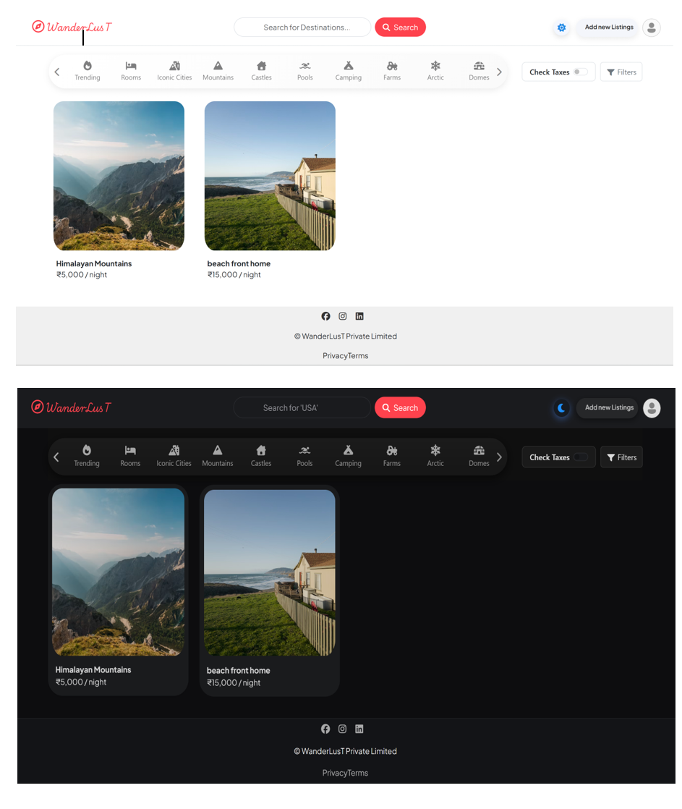
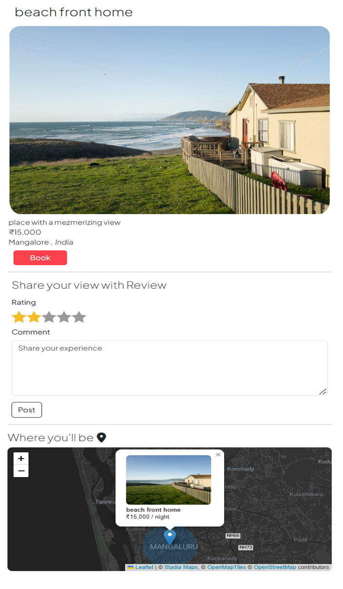
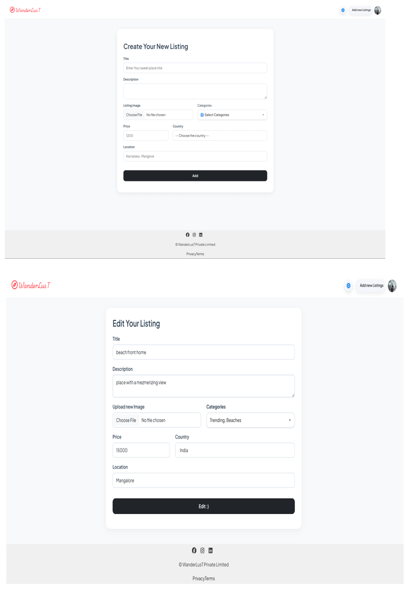
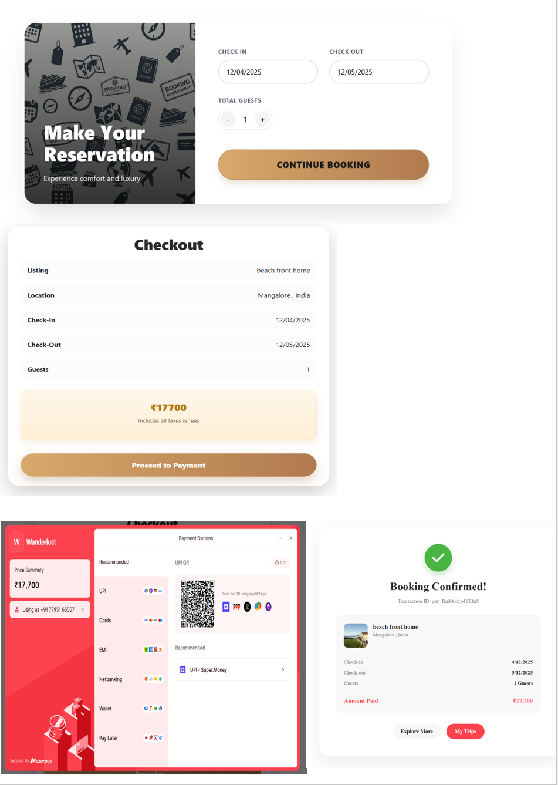
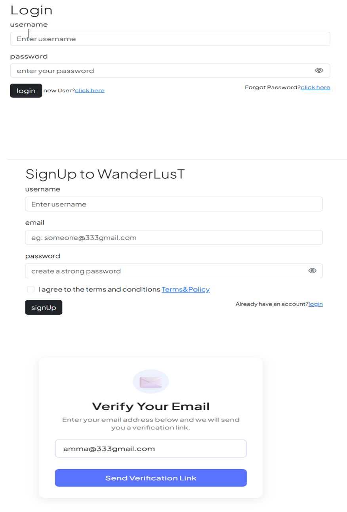
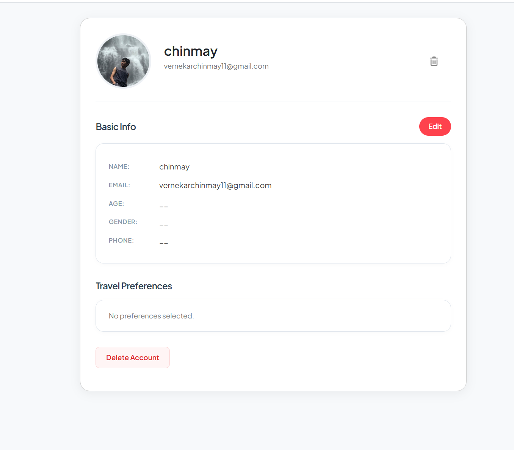

# ✈️ WanderlusT


**Wanderlust** is a full-stack web application inspired by Airbnb. It is a comprehensive platform where users can publish property listings, review locations, and book stays. The project follows the **MVC (Model-View-Controller)** architectural pattern to ensure code modularity and scalability.

## 🌟 Key Features

* **User Authentication & Authorization:** Secure login and signup using **Passport.js**.
* **Email Verification:** Mandatory email verification ensures that only verified users can book stays, preventing spam and enhancing security.
* **User Profile Management:** Users can customize their profiles, edit personal details, and upload profile pictures.
* **CRUD Operations:** Users can Create, Read, Update, and Delete property listings.
* **Booking System:** Users can book stays, with backend validation preventing double bookings.
* **Email Notifications:** Automated email confirmation sent to listing owners & to the user  upon successful booking (by **Nodemailer**).
* **Reviews & Ratings:** Guests can leave reviews and ratings for properties they have visited.
* **Interactive Maps:** Integration with **LeafLet** to show exact property locations using **opencage Geocoder** and **stadia maps (tile provider)** .
* **Image Uploads:** Cloud storage support using **Cloudinary** for listing images.
* **Dark Mode:** A togglable dark theme for better user experience in low-light environments.
* **MVC Architecture:** Clean separation of concerns for better maintainability.

## 🛠️ Tech Stack

**Frontend:**
* HTML5, CSS3
* Bootstrap (for responsive design)
* EJS (Embedded JavaScript Templates)

**Backend:**
* Node.js
* Express.js

**Database:**
* MongoDB (NoSQL)
* Mongoose (ODM)

**Tools & Libraries:**
* **Authentication:** Passport, Passport-Local
* **Image Storage:** Cloudinary
* **Maps:** LeafLet Map Viewer, OpecCage Geocoding API , Stadia Maps (tile provider)
* **Email:** Nodemailer
* **Validation:** Joi (Server-side validation)

## 📂 Directory Structure

```text
Wanderlust/
├── config/             # nodemailer function 
├── cloudConfig.js      # Cloudinary configuration
├── controllers/        # Logic for Listings, Reviews, and Users
├── models/             # Mongoose Schemas (Listing, Review, User, Booking)
├── routes/             # Express Routes
├── utils/              # Error handling 
├── views/              # EJS Templates
├── public/             # Static files (CSS, JS, Images)
├── app.js              # Main entry point
├── middleware.js       # Middleware wrappers
├── schema.js           # Joi validation 
└── .env                # Environment variables


```

## 🚀 Getting Started

Follow these steps to set up the project locally on your machine.

### Prerequisites

Make sure you have the following installed on your machine:
* [Node.js](https://nodejs.org/) (v14 or higher)
* [npm](https://www.npmjs.com/) (Node Package Manager)
* [MongoDB](https://www.mongodb.com/try/download/community) (If running locally)

### Installation

1.  **Clone the Repository**
    ```bash
    git clone https://github.com/ChinmayGV/WanderLusT.git
    ```

2.  **Install Dependencies**
    ```bash
    npm install
    ```

3.  **Configure Environment Variables**
    Create a `.env` file in the root directory of the project. Add the following variables (you will need your own API keys):

    ```env
    CLOUD_NAME=your_cloudinary_name
    CLOUD_API_KEY=your_cloudinary_api_key
    CLOUD_API_SECRET=cloudinary_secret
    OPENCAGE_MAP_TOKEN=opencage_geocoder_token
    ATLAS_DB_URL=mongodb_atlas_url
    SECRET=your_session_secret
    EMAIL_PASS=your_email_app_password
    EMAIL_USER=email_to_send_emails
    RAZORPAY_KEY_ID=payment_gateway_keyId(test mode)
    RAZORPAY_KEY_SECRET=payment_gateway_secret
    ```

4.  **Seed the Database (Optional)**
    If you want to start with some dummy data:
    ```bash
    node init/index.js
    ```

5.  **Run the Application**
    ```bash
    node app.js
    ```
    *or if you have nodemon installed:*
    ```bash
    nodemon app.js
    ```

6.  **Access the App**
    Open your browser and navigate to:
    `http://localhost:3333`

---


## 📸 Project Screenshots

| 🏠 Landing Page(Light/Dark) | 🗺️ Map Integration & show page |
|:---:|:---:|
|  |  |

| 📝 Add Listing & Edit Form | ✅ Booking flow |
|:---:|:---:|
|  |  |

| 🔐 Login/Signup | 👤 User Profile |
|:---:|:---:|
|  |  |
